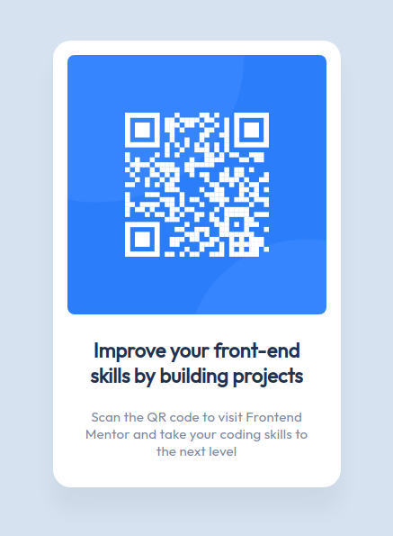

# Frontend Mentor - QR code component solution

This is a solution to the [QR code component challenge on Frontend Mentor](https://www.frontendmentor.io/challenges/qr-code-component-iux_sIO_H). Frontend Mentor challenges help you improve your coding skills by building realistic projects.

## Table of contents

- [Overview](#overview)
  - [Screenshot](#screenshot)
  <!-- - [Links](#links) -->
  - [Built with](#built-with)
  - [Continued development](#continued-development)
- [Author](#author)

## Overview

This is a simple, state qr component built using HTML and CSS. In order to replicate the designs detailed in figma, I took advantage of CSS Flexbox for centering the the QR Code and used rem for scalability.

### Screenshot

<!-- ### Links

- Solution URL: [Add solution URL here](https://your-solution-url.com)
- Live Site URL: [Add live site URL here](https://your-live-site-url.com) -->

### Built with

- Semantic HTML5 markup
- CSS custom properties
- Flexbox

### Continued development

This was a nice project for getting back into the front end development workflow; taking designs and requirements and building them. From here, a next step could be turning this into a reusable component using Storybook.

## Author

- Website - [Bola Adebesin](https://www.badebesin.com/)
- Frontend Mentor - [@MobolanleAdebesin](https://www.frontendmentor.io/profile/MobolanleAdebesin)
